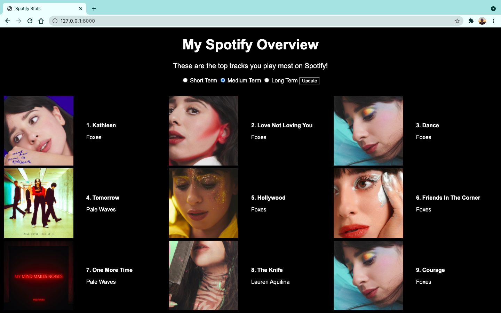

# Spotify-Stats

Spotify-Stats is a web app I have worked on during my summer break from University. It connects to the Spotify Developer API to display a users top tracks they've streamed most. The user can interact with the web app to select whether to display either short, medium or long term top tracks. They are also able to click on any song on the web app which will take them directly to the song on Spotify.

## Languages/Frameworks:

This project uses the Python framework Django. To run this web app locally, you will need to ensure that you have the Django framework installed. To install Django, execute the following command:

python -m pip install django

To ensure that the installation was successful, you can run the following command:

python -m django --version

If Django has successfully been installed, you should see the version of Django installed.

The Spotipy library will also need to be installed using the following command:

pip install spotipy

Note, you will also need to export the following environment variables, SPOTIPY_CLIENT_ID and SPOTIPY_CLIENT_SECRET.

## Run the Project: 

To set up the migrations and start the Django development server to run the web app, run the following commands:

python manage.py runserver

The web app will then be accessible at the following location: http://127.0.0.1:8000/

## My Motivation:

Two of my passions are programming and music, thus this project provided an amalgamation of both interests. This project gave me hands on experience working with an API, as well as practice designing and developing web apps. 

## Web App Preview:

